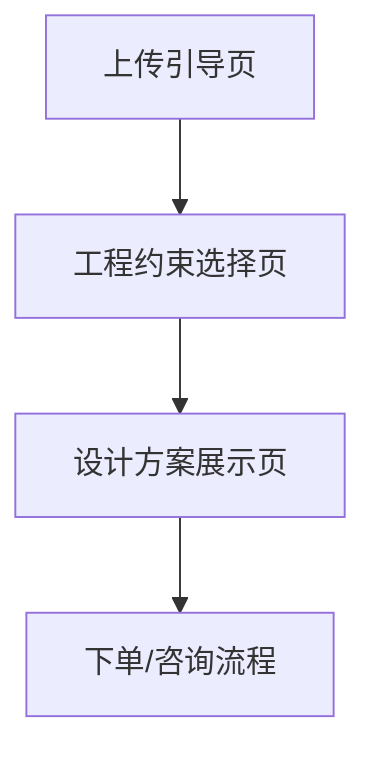

## 1. 产品概述
这是一款AI驱动的旧房改造辅助工具，用户上传房屋图片后，AI将结合现实的工程约束和可售商品，生成兼具美学与可行性的装修效果图，旨在高效地将设计灵感转化为商业订单。

## 2. 核心功能

### 2.1 功能模块
我们的旧房改造工具主要包含以下核心页面：
1.  **上传引导页**: 用户上传需要改造的房屋图片。
2.  **工程约束选择页**: 用户根据实际情况选择改造的硬性限制条件。
3.  **设计方案展示页**: 展示AI生成的效果图、关联的商品清单及总价，并引导下单。

### 2.2 页面详情
| 页面名称 | 模块名称 | 功能描述 |
| --- | --- | --- |
| 上传引导页 | 图片上传模块 | - 支持用户从本地设备选择或拖拽上传房屋图片。 - 提示用户上传清晰、光线充足的室内照片。 - 上传成功后自动进入下一步。 |
| 工程约束选择页 | 工程边界约束 | - 提供“是否改动水电？”的是/否选项。 - 提供“是否保留原有地板？”的是/否选项。 - 用户完成选择后，点击“生成方案”按钮。 |
| 设计方案展示页 | AI效果图展示 | - 展示AI根据用户上传的图片和约束条件生成的高清效果图。 |
| | 方案匹配 (商品清单) | - 以列表形式展示效果图中所使用的具体商品（如沙发、灯具、墙漆等）。 - 每件商品关联到实际的库存产品，显示名称和图片。 - 在清单底部显示“整包价格”，并提供一个明确的“一键下单”或“咨询设计师”按钮。 |

## 3. 核心流程
核心用户流程是线性的，旨在快速将用户的初步想法转化为具体的、可购买的设计方案。

**用户流程:**
用户访问工具，在**上传引导页**上传一张旧房照片。接着，页面跳转至**工程约束选择页**，用户在此选择是否改动水电、是否保留地板等关键工程选项。完成选择后，AI开始处理并生成设计。最终，用户在**设计方案展示页**看到改造后的效果图，以及图中所有家具、建材的商品清单和打包总价，并可通过页面按钮直接下单或发起咨询。

## 4. 用户界面设计

### 4.1 设计风格
- **主色调**: 采用中性、温暖的色调（如米白 #F5F5DC, 暖灰 #BEBEBE），营造出舒适、有格调的氛围。
- **辅助色**: 使用饱和度稍高的强调色（如深青色 #008B8B）用于按钮和关键交互提示，激发用户的决策行为。
- **按钮风格**: 扁平化、带有轻微圆角，鼠标悬浮时有细微的放大或阴影效果。
- **字体**: 使用无衬线字体（如思源黑体），正文字号16px，标题字号24px，以确保可读性和现代感。
- **布局风格**: 卡片式布局，将效果图和商品清单清晰地分块展示，整体界面简洁、聚焦。
- **视觉策略**: 整体视觉应体现“视觉阶层降维策略”，即设计风格比大众平均水平略高，营造一种“跳一跳就够得着”的 aspirational（愿景）美学。

### 4.2 页面设计概览
| 页面名称 | 模块名称 | UI元素 |
| --- | --- | --- |
| 上传引导页 | 图片上传模块 | - 页面中央一个大的、虚线边框的拖拽区域。 - 清晰的“点击上传”按钮和简短的文字说明。 - 整体背景干净，突出上传功能。 |
| 工程约束选择页 | 工程边界约束 | - 以清晰的卡片或列表形式展示问题。 - 使用开关（Toggle）或样式化的复选框（Checkbox）供用户选择。 - “生成方案”按钮在页面底部居中，样式醒目。 |
| 设计方案展示页 | AI效果图展示 | - 效果图占据页面主要视觉区域，确保高清晰度。 - 可提供“查看原图对比”的悬浮按钮。 |
| | 方案匹配 (商品清单) | - 在效果图右侧或下方以滚动列表展示商品卡片。 - 每个卡片包含商品缩略图、名称。 - 列表底部固定显示总价和“一键下单”主操作按钮。 |

### 4.3 响应式设计
采用桌面优先的设计方法，确保在大屏幕上提供最佳的视觉和交互体验。后续可适配移动端，优化触控操作。
