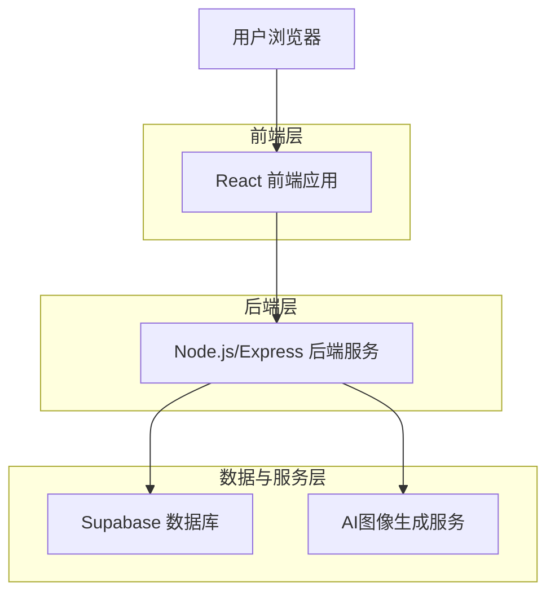
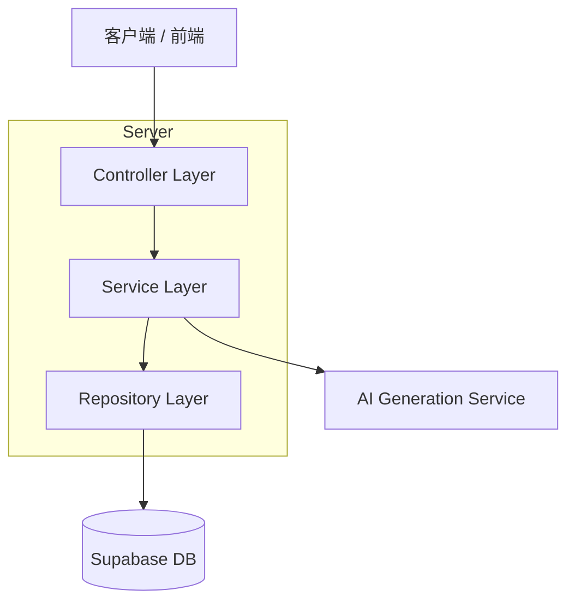
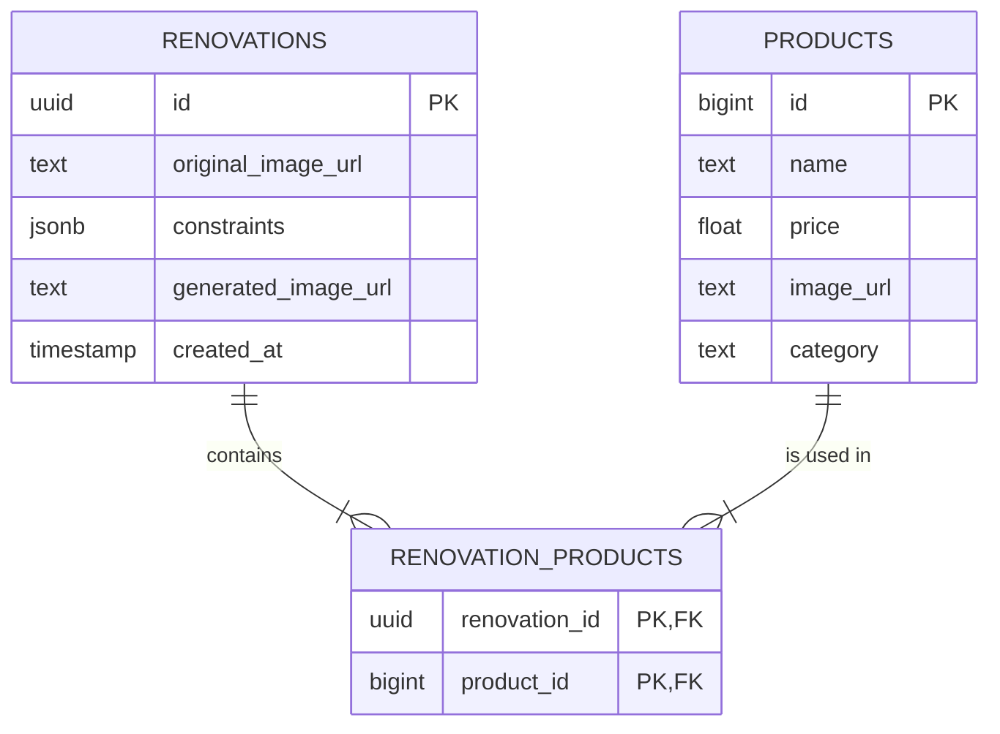

## 1. 架构设计
为了处理AI图像生成和管理商品数据，我们采用前后端分离的架构。前端负责用户交互，后端处理核心业务逻辑和与数据库、AI服务的通信。



## 2. 技术描述
- **前端**: React@18 + tailwindcss@3 + vite
- **初始化工具**: vite-init
- **后端**: Node.js + Express@4
- **数据库**: Supabase (PostgreSQL)

## 3. 路由定义
| 路由 | 用途 |
| --- | --- |
| / | 首页，即图片上传引导页 |
| /design | 设计流程页面，包含工程约束选择和最终的设计方案展示 |
| /login | (可选) 用户登录页，用于保存用户的设计历史 |

## 4. API 定义

### 4.1 核心API

#### 创建设计方案
`POST /api/renovations`

**请求体:**
| 参数名 | 参数类型 | 是否必需 | 描述 |
| --- | --- | --- | --- |
| imageUrl | string | true | 用户上传的原始图片URL |
| constraints | object | true | 用户选择的工程约束条件，例如 `{"plumbing": false, "flooring": true}` |

**响应体:**
| 参数名 | 参数类型 | 描述 |
| --- | --- | --- |
| id | string | 本次设计方案的唯一ID |
| generatedImageUrl | string | AI生成的效果图URL |
| products | array | 方案中使用的商品对象数组，每个对象包含id, name, price, imageUrl |

**请求示例:**
```json
{
  "imageUrl": "https://example.com/user_upload.jpg",
  "constraints": {
    "plumbing": false,
    "flooring": true
  }
}
```

## 5. 服务端架构图


## 6. 数据模型

### 6.1 数据模型定义
我们将需要一个表来存储商品信息，另一个表来记录每次的改造请求和结果。



### 6.2 数据定义语言 (DDL)

**商品表 (products)**
```sql
-- 创建商品表
CREATE TABLE products (
    id BIGINT PRIMARY KEY GENERATED ALWAYS AS IDENTITY,
    name TEXT NOT NULL,
    price REAL NOT NULL,
    image_url TEXT,
    category TEXT
);

-- 启用行级安全
ALTER TABLE products ENABLE ROW LEVEL SECURITY;

-- 策略：允许公共读取，但只有服务角色能写入
CREATE POLICY "Public read access for products" ON products FOR SELECT USING (true);
CREATE POLICY "Allow service role to manage products" ON products FOR ALL USING (auth.role() = 'service_role');

GRANT SELECT ON products TO anon;
GRANT ALL ON products TO service_role;
```

**改造方案表 (renovations)**
```sql
-- 创建改造方案表
CREATE TABLE renovations (
    id UUID PRIMARY KEY DEFAULT gen_random_uuid(),
    original_image_url TEXT NOT NULL,
    constraints JSONB,
    generated_image_url TEXT,
    created_at TIMESTAMPTZ DEFAULT NOW()
);

-- 启用行级安全
ALTER TABLE renovations ENABLE ROW LEVEL SECURITY;

-- 策略：只有服务角色可以访问
CREATE POLICY "Allow service role to manage renovations" ON renovations FOR ALL USING (auth.role() = 'service_role');

GRANT ALL ON renovations TO service_role;
```

**方案-商品关联表 (renovation_products)**
```sql
-- 创建关联表
CREATE TABLE renovation_products (
    renovation_id UUID REFERENCES renovations(id) ON DELETE CASCADE,
    product_id BIGINT REFERENCES products(id) ON DELETE CASCADE,
    PRIMARY KEY (renovation_id, product_id)
);

-- 启用行级安全
ALTER TABLE renovation_products ENABLE ROW LEVEL SECURITY;

-- 策略：只有服务角色可以访问
CREATE POLICY "Allow service role to manage relations" ON renovation_products FOR ALL USING (auth.role() = 'service_role');

GRANT ALL ON renovation_products TO service_role;
```
